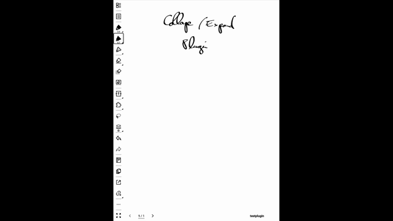

# Collapse / Expand — User Guide

## Get the plugin

**[⬇ Download collapse_expand.snplg](https://github.com/vincentaravantinos/supernote-collapse-expand/releases/latest/download/collapse_expand.snplg)**
— click the link, then on your Supernote device go to **Settings → Plugins →
Install plugin → pick file**, choose the downloaded `collapse_expand.snplg`,
and tap **Install**.

## Demo

Collapse / Expand lets you hide a region of your handwriting behind a small `+`
icon, bring it back when you need it, and tuck it away again when you're done.
The rest of the page stays fully usable the whole time — you can keep writing,
panning, and selecting around a collapsed region.

All actions use the **Collapse / Expand** button in the lasso menu: make a
selection with the lasso, then tap the button.

**Shortcut**: a single tap of your **finger** directly on a `+` icon (or a
section's name, if it has one) expands or recollapses it on the spot — no
lasso or button needed. (A pen tap just draws, as usual.)

---

## The three actions

### Collapse — hide a region

1. Lasso the handwriting you want to hide.
2. Tap **Collapse / Expand**.

The selected content disappears and a small `⊕` icon appears just above and to
the left of where it was. The icon holds everything needed to bring the content
back later.

Pictures and titles inside the lasso are left in place — they aren't collapsed.

### Expand — bring it back

1. Lasso the `+` icon.
2. Tap **Collapse / Expand**.

The content reappears where it was, the icon switches to `⊖`, and a white area
with a thin outline marks the section's boundary, so you can see exactly what
belongs to it.

### Recollapse — put it away again

1. Lasso the `+` icon **or** any of the restored content, or the white area
   itself.
2. Tap **Collapse / Expand**.

The content hides again, the white area disappears, and the icon switches back
to `⊕`. The icon stays right where it is.

---

## Working with several sections at once

- **Expand many at once** — lasso several `+` icons together and tap the button;
  they all expand in one go. Any other handwriting in the lasso is left alone.
- **Recollapse many at once** — one lasso that covers several expanded sections
  recollapses all of them at once.
- **Mixed selections** — if a single lasso covers both an expanded section and a
  collapsed `+` icon, recollapsing takes priority: the expanded section(s) are
  put away, and the collapse/expand is ignored for that tap.

---

## How to resize an existing section or move the anchor position

You reshape or relocate a section by **dragging its `+` icon** — and it behaves
differently depending on whether the section is collapsed or expanded:

- **While collapsed** — dragging the icon moves the **whole section**. When you
  expand it again, the content reappears at the icon's new spot.
- **While expanded** — dragging the icon **reshapes the section's area** instead.
  The restored content stays where it is, and the white area stretches so the
  icon sits at its edge. Drag the icon a little to fine-tune the boundary, or
  drag it far away to turn the section into a large, mostly-empty area.

  When you release the icon while expanded, the section redraws at its new shape.
  This takes a moment longer than an ordinary page pan, so it's meant for the
  occasional adjustment rather than continuous dragging.

---

## Naming a section

You can give a collapsed section a handwritten name so you can tell sections
apart at a glance:

1. Write the name on the page.
2. Lasso it together with the section's `+` icon.
3. Tap **Collapse / Expand** — you'll be asked to confirm before the name is
   set (or replaced, if the section already has one).

The name appears next to the icon with a thin underline beneath it, and stays
visible whether the section is collapsed or expanded. It only moves when you
drag the icon while the section is expanded (it follows rigidly) — nothing
else repositions it.

---

## Modifying the content of an existing section

You can add to a section while it's expanded. Any new strokes you write on top of
an expanded section are folded into it when you recollapse — so they come back
the next time you expand.

Handwriting that was already on the page underneath the section (before you
expanded it) is left exactly where it is and is **not** pulled into the section.

---

## Good to know

- **It's safe to power off.** Sections are remembered across turning the device
  off, app restarts, and page reloads. You can always perform the next action on
  any section after powering back on.
- **One page at a time.** A section lives on a single page; it doesn't span pages.
- **Don't overlap or nest sections.** Collapsing a region that contains another
  section's icon isn't supported.
- **Very large selections.** If a selection is too big to store, the plugin
  declines with a message rather than collapsing it partially — just collapse a
  smaller region.
- **Slower on busy pages.** Collapse, expand and recollapse get slower the more
  handwriting the page holds (not just what you selected) — on a very dense page
  an operation can take several seconds. The "working" indicator shows while it
  runs; just wait for it to finish.
- **Dragging an expanded section's icon after a device reboot.** If a
  section is still expanded when you **reboot the device** (not just switch
  apps), dragging its icon to reshape it won't do anything until you either
  recollapse and re-expand the section, or reboot a second time. Tapping the
  icon to collapse or expand it works normally the whole time — only the
  live drag-to-reshape is affected.
- **Typed text boxes are hidden when expanded.** If your selection includes a
  typed **text box**, it still collapses and is preserved, but when you expand the
  section the text box is covered by the section's white area and won't be
  visible. This is a Supernote limitation, not the plugin: the device always draws
  text boxes *beneath* handwriting and shapes, so the section's mask sits on top of
  them. Handwriting (including recognized handwriting) is unaffected — avoid
  collapsing typed text boxes for now.
