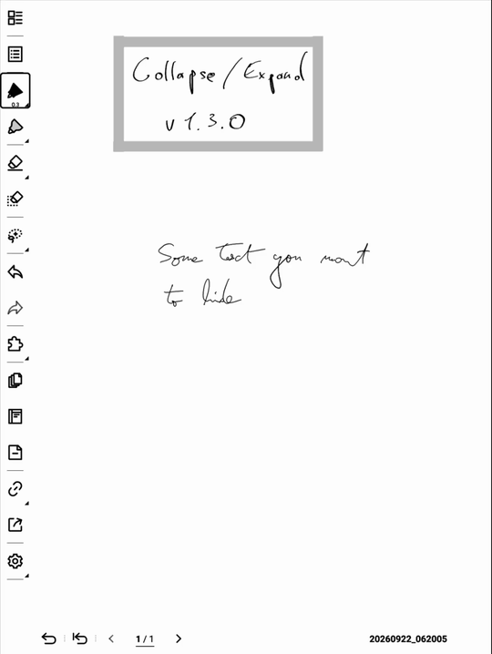

# Collapse / Expand — User Guide

## Get the plugin

**[⬇ Download collapse_expand.snplg](https://github.com/vincentaravantinos/supernote-collapse-expand/releases/latest/download/collapse_expand.snplg)**
— click the link, then on your Supernote device go to **Settings → Plugins →
Install plugin → pick file**, choose the downloaded `collapse_expand.snplg`,
and tap **Install**.

## Demo

Collapse / Expand lets you hide a region of your handwriting behind a small
`⊕` icon, bring it back when you need it, and tuck it away again when you're
done. The rest of the page stays fully usable the whole time — you can keep
writing, panning, and selecting around a collapsed region.

## How you use it

- **Tap an icon with your finger** to expand or collapse that section. This
  is the everyday gesture. Tapping the section's name works too. (A pen tap
  just draws, as usual.)
- **Lasso + the Collapse / Expand button** (in the lasso menu) for everything
  else: collapsing new content, naming a section, and acting on several
  sections at once. The button does the one thing that makes sense for your
  selection straight away, and only asks when there's a real choice. If
  there's nothing it can do — for example you lassoed a single icon — it
  reminds you to tap the icon instead.

The plugin's questions and messages appear in a small card titled
**Collapse / Expand**.

---

## Collapse — hide a region

1. Lasso the handwriting you want to hide.
2. Tap **Collapse / Expand**.

The selected content disappears and a small `⊕` icon appears just above and to
the left of where it was. The icon holds everything needed to bring the content
back later.

Only handwriting, shapes and links can be collapsed. **Pictures, titles and
typed text boxes stay on the page.** If your lasso mixes them with
handwriting, you're warned first and can choose **Collapse anyway** or
**Cancel**.

## Expand and collapse — tap the icon

- **Tap a `⊕` icon** with your finger: the content reappears where it was, the
  icon switches to `⊖`, and a white area with a thin outline marks the
  section's boundary, so you can see exactly what belongs to it.
- **Tap a `⊖` icon**: the content hides again, the white area disappears, and
  the icon switches back to `⊕`. The icon stays right where it is.

---

## Working with several sections at once

Lasso several sections (their icons, or an expanded section's content) and tap
**Collapse / Expand**:

- **All collapsed** — they all expand in one go.
- **All expanded** — they all collapse in one go.
- **A mix** — you're asked: **Expand all sections**, **Collapse all
  sections**, or **Cancel**.

Any other handwriting in the lasso is left alone.

---

## Resizing or moving a section

- **Drag the icon while collapsed** to move the **whole section**. When you
  expand it again, the content reappears at the icon's new spot.
- **Drag the icon while expanded** to **reshape the section's area**. The
  content stays where it is, and the white area stretches so the icon sits at
  its edge. Drag it far away to make a large, mostly-empty area. If you drop
  the icon inside the area, it's placed just outside the nearest edge.
- **Drag the small `◢` handle** at the bottom-right corner of an expanded
  section to resize it from that corner, without moving the icon.

You can drag with the **pen or a finger**. With a finger, nothing moves while
your finger is down — the new shape appears when you lift it. Each resize
redraws the section, which takes a moment, so it's meant for the occasional
adjustment rather than continuous dragging.

---

## Naming a section

Give a section a handwritten name so you can tell sections apart at a glance.
It works whether the section is collapsed or expanded.

1. Write the name on the page, next to the icon.
2. Lasso it together with the section's icon.
3. Tap **Collapse / Expand** and confirm with **Set as name**.

The name gets a thin underline and stays visible whether the section is
collapsed or expanded. It only moves when you drag the icon of an expanded
section — it follows the icon.

- **Renaming** works the same way. You're asked to confirm, because the old
  name is replaced.
- **Fixing the underline** — if you erase part of a name, lasso what's left
  together with the icon and tap the button: the underline is redrawn to fit.
- **Erasing a name completely** also removes its underline, the next time you
  use the plugin on that page.
- **Write the name outside the section's white area.** A name written inside
  it ends up hidden under the white area the next time the section expands.

---

## Adding to a section

You can add to a section while it's expanded. Anything new you write on top of
an expanded section is folded into it when you collapse it — so it comes back
the next time you expand.

Handwriting that was already on the page underneath the section (before you
expanded it) is left exactly where it is and is **not** pulled into the section.

---

## Good to know

- **First use asks for permission.** The first time you use the plugin
  in any way (button, tap, or dragging an icon), Supernote will ask you to
  allow it to read and change the page — this is required for the plugin to
  work at all. If you decline, that particular action is cancelled with the
  page left unchanged, and you'll be asked again the next time you try.
- **It's safe to power off.** Sections are remembered across turning the device
  off, app restarts, and page reloads.
- **One page at a time.** A section lives on a single page; it doesn't span pages.
- **Don't overlap or nest sections.** Collapsing a region that contains another
  section's icon isn't supported.
- **Very large selections.** If a selection is too big to store, the plugin
  declines with a message rather than collapsing it partially — just collapse a
  smaller region.
- **Slower on busy pages.** Operations get slower the more handwriting the page
  holds (not just what you selected) — on a very dense page one can take
  several seconds. The "Working…" card shows while it runs; just wait for it
  to finish.
- **Dragging an expanded section's icon after a device reboot.** If a
  section is still expanded when you **reboot the device** (not just switch
  apps), dragging its icon to reshape it won't do anything until you collapse
  and re-expand the section, or reboot a second time. Tapping the icon works
  normally the whole time.
- **Older sections with text boxes.** A section collapsed with an earlier
  version may contain a typed text box. It still comes back, but stays hidden
  under the section's white area while expanded — Supernote always draws text
  boxes beneath handwriting.
